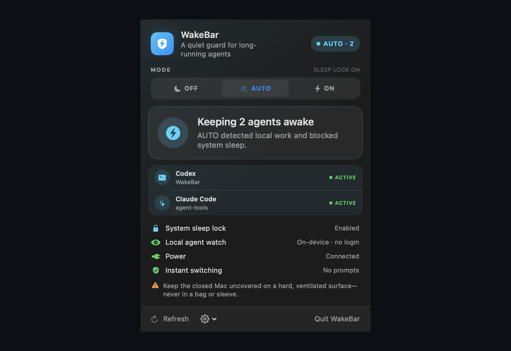
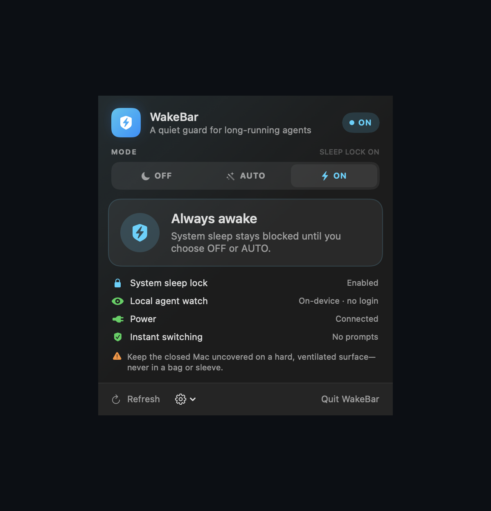
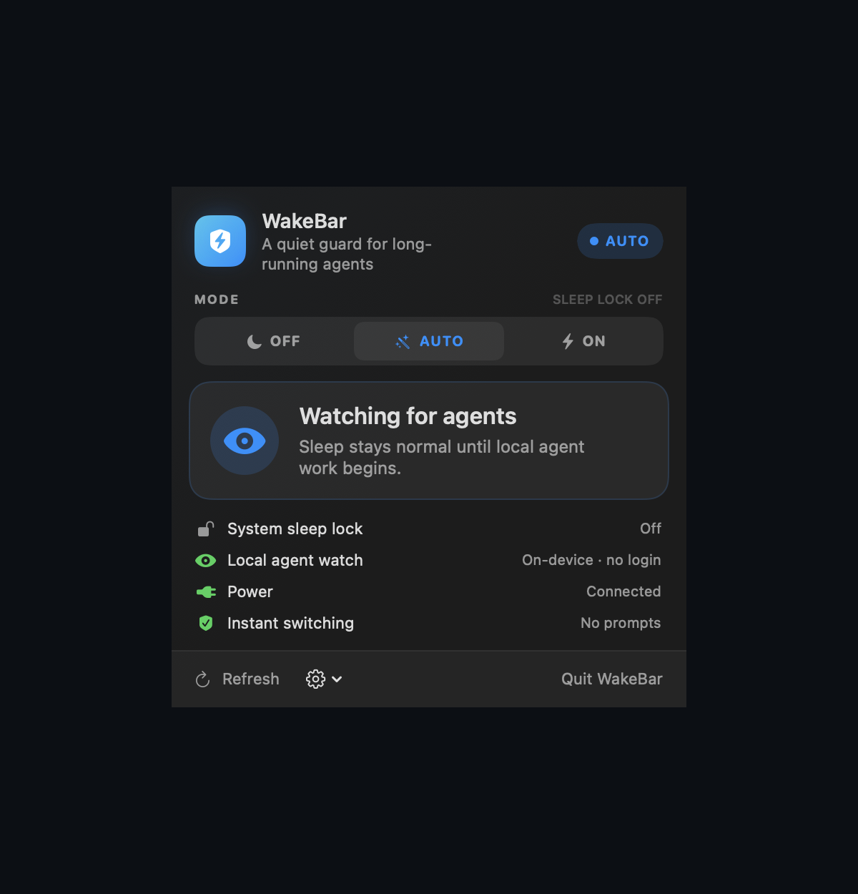
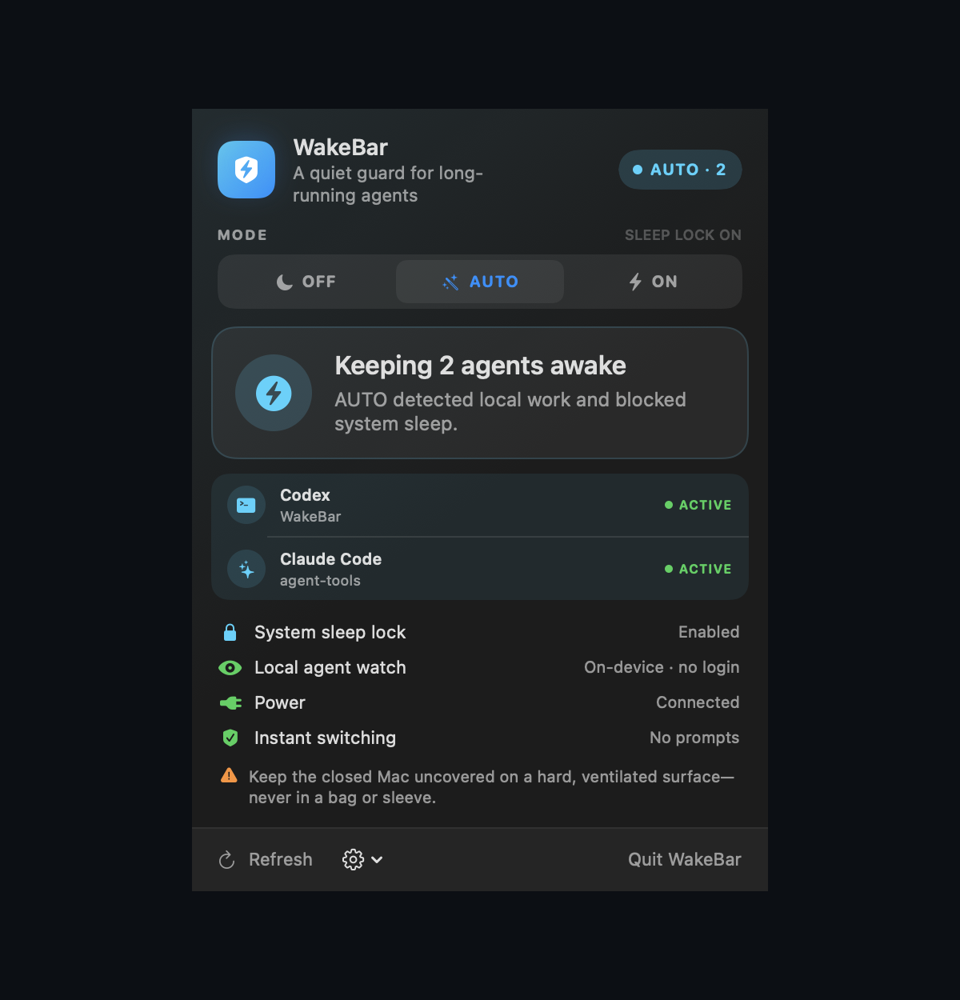
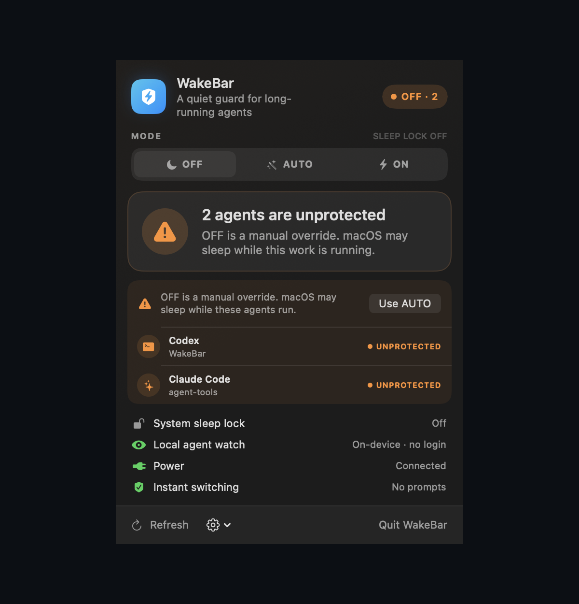
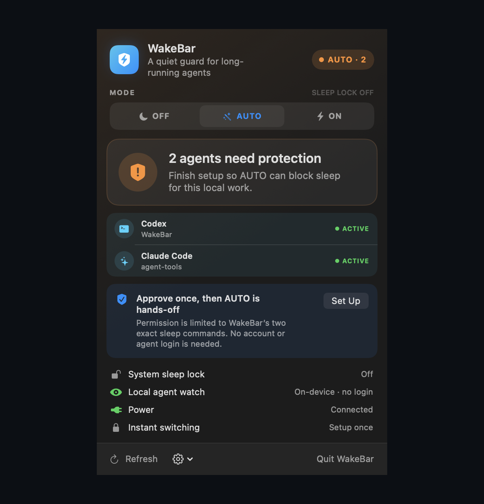

<div align="center">

# WakeBar

### A quiet, local sleep guard for long-running coding agents on macOS.

Keep the Mac awake while agents work. Restore normal sleep when they finish.

<p>
  
  
  
  
</p>

</div>



WakeBar is a native menu-bar utility for people who let coding agents run in
the background. Its **AUTO** mode watches local agent activity, enables the
system sleep lock only while work is running, and restores normal sleep after a
90-second safety window.

- **Agent-aware:** sees active local Codex, Claude Code, Cursor, and many CLI
  agents instead of treating every open editor as work.
- **Private by design:** no account, cloud service, telemetry, or prompt access.
- **Hands-off after setup:** one narrowly scoped administrator approval enables
  prompt-free switching between sleep states.

> [!IMPORTANT]
> WakeBar is currently distributed as source. The local build is ad-hoc signed,
> not Developer ID signed or notarized.

## Quick start

Requirements: macOS 13 or later and Swift 6 / Xcode command-line tools.

```sh
git clone https://github.com/inevident/WakeBar.git
cd WakeBar
./Scripts/build-app.sh
open ./dist/WakeBar.app
```

Choose **AUTO**, then approve the one-time setup when prompted. WakeBar remains
in the menu bar and polls for local agent activity every five seconds.

## Three modes

| Mode | Behavior | Best for |
| --- | --- | --- |
| **OFF** | Restores normal macOS sleep immediately. Active agents remain visible and are marked unprotected. | A deliberate manual override. |
| **AUTO** | Blocks sleep when local agent work starts, then releases it 90 seconds after the final task finishes. | Everyday use. |
| **ON** | Continuously blocks system sleep until OFF or AUTO is selected. | Work WakeBar cannot detect or a temporary always-awake session. |

<p align="center">
  
  <br>
  <sub><strong>ON mode:</strong> a clear manual hold when continuous wakefulness is intentional.</sub>
</p>

The selected mode is separate from the verified physical sleep lock. WakeBar
checks the real `SleepDisabled` state every 20 seconds and repairs drift caused
by another command or an OS-state change.

## See it in action

<table>
  <tr>
    <td width="50%">
      
    </td>
    <td width="50%">
      
    </td>
  </tr>
  <tr>
    <td align="center"><strong>AUTO idle</strong><br>Normal sleep remains available while WakeBar watches locally.</td>
    <td align="center"><strong>AUTO active</strong><br>Detected work turns on the verified sleep lock immediately.</td>
  </tr>
</table>

<table>
  <tr>
    <td width="50%">
      
    </td>
    <td width="50%">
      
    </td>
  </tr>
  <tr>
    <td align="center"><strong>Visible manual override</strong><br>OFF never hides the work it leaves unprotected.</td>
    <td align="center"><strong>One-time setup</strong><br>Approval is limited to WakeBar's two exact sleep commands.</td>
  </tr>
</table>

## How AUTO works

```text
local agent starts
        ↓
process + lifecycle evidence is correlated on-device
        ↓
system sleep lock turns on
        ↓
final agent finishes → 90-second safety window
        ↓
normal macOS sleep returns
```

WakeBar fails safe. An interrupted or inconclusive scan never releases an
already-active sleep lock, while positive activity can still engage the lock
when a secondary signal is temporarily unavailable.

### Runtime detection

| Runtime | Local signal |
| --- | --- |
| **Codex** | Correlates exact Codex processes with writable rollout files and lifecycle events such as task started, completed, or aborted. Persistent app-server processes do not count. |
| **Claude Code** | Validates each live PID against Claude's local session registry and process start time. `busy` and `shell` count; idle prompts and sessions waiting for input do not. |
| **Cursor** | Correlates the Cursor app, agent-loop sleep assertion, transcript lifecycle, `AwaitShell` identifiers, and verified terminal manifests. |
| **Named agent CLIs** | Uses exact executable identity and process liveness for supported command-line agents. |
| **Antigravity IDE** | Recognizes an actively working local language-server process without treating the always-open app as activity. |

<details>
<summary><strong>More recognized CLIs and model hosts</strong></summary>

WakeBar recognizes OpenCode, Copilot CLI, Gemini CLI, Aider, Goose, Amp, Kiro,
Factory Droid, Codebuff, Qoder, Cline, Kilo Code, Crush, Antigravity CLI, and
other exact named executables.

DeepSeek, MiniMax, and Groq are often models selected inside another runtime,
such as Cursor or OpenCode. In that case WakeBar protects the work by detecting
the host runtime. It also recognizes standalone `deepseek-code`, `minimax-code`,
and `groq-build` style CLIs when installed under those names.

</details>

## Local-only privacy

WakeBar makes no network requests and needs no Codex, Claude, Cursor, GitHub,
or model-provider login.

It never reads prompt text or response text. The popover retains only transient
display metadata:

- runtime name;
- optional project-folder basename;
- process ID;
- lifecycle state.

Nothing is uploaded or written to a WakeBar activity log.

## One-time prompt-free setup

`pmset` requires root privileges. Selecting AUTO or clicking **Set Up** asks for
administrator approval once and installs a root-owned, mode `0440` rule at:

```text
/private/etc/sudoers.d/zzzz_wakebar_<numeric-user-id>
```

That rule permits the current macOS user to run only these two fixed commands
without another password prompt:

```text
/usr/bin/pmset -a disablesleep 0
/usr/bin/pmset -a disablesleep 1
```

It does not authorize a shell, arbitrary `pmset` arguments, environment
preservation, or any other root command. Runtime changes use non-interactive
`sudo` and fail closed. WakeBar never receives or stores the administrator
password.

Any process running as the same macOS user can invoke those two exact commands.
This is a pragmatic design for a personal, locally built utility. A broadly
distributed release should use a Developer ID-signed and notarized privileged
helper.

The gear menu can repair or remove instant switching. Removal asks for approval,
turns the sleep lock off, verifies the exact receipt, and removes only that file.

## Safety and limitations

Blocking system sleep can consume substantial power. Connect power for long
runs and keep a closed Mac uncovered on a hard, ventilated surface—never in a
bag or sleeve.

WakeBar prevents system sleep; it cannot protect work from battery exhaustion,
shutdowns, restarts, software updates, thermal protection, network loss, or an
agent process exiting. Apple does not document `disablesleep` in the `pmset` man
page, so verify closed-lid behavior on the Mac and macOS release you rely on.

AUTO requires WakeBar to remain running so it can observe transitions. If the
app quits while the physical sleep lock is enabled, that system-wide setting
persists. WakeBar warns before quitting and offers to turn it off first.

## FAQ

### Why does WakeBar need administrator approval?

macOS restricts system-wide `pmset` changes to root. WakeBar uses one approval
to install a receipt that allows only the exact enable and disable commands.

### Does AUTO need WakeBar to stay open?

Yes. WakeBar performs the local scan and restores normal sleep after work ends.

### Does an open editor count as an active agent?

No. Persistent GUI apps and helpers are filtered out. WakeBar looks for active
process and lifecycle evidence associated with agent work.

### Does quitting WakeBar automatically restore sleep?

Not silently. If the physical lock is enabled, WakeBar warns and offers to turn
it off before quitting.

### Will it always keep a closed MacBook running?

WakeBar controls the system sleep setting, but lid behavior varies by hardware,
power state, peripherals, and macOS release. Test the exact setup you depend on.

## Development

Build the app:

```sh
./Scripts/build-app.sh
```

Run the test suite:

```sh
swift test -Xswiftc -warnings-as-errors
```

The 71 tests cover process filtering, Codex, Claude, and Cursor lifecycle
parsing, power assertions, terminal manifests, custom runtime homes, degraded
scans, OFF/AUTO/ON transitions, grace timing, external-state repair, exact
privileged arguments, sudoers safety, and authorization failures. Tests use
injected actors and never modify the host Mac's power or sudoers settings.

For a read-only detector snapshot:

```sh
swiftc -parse-as-library -warnings-as-errors \
  Scripts/diagnose-agents.swift \
  Sources/WakeBar/AgentActivityDetector.swift \
  Sources/WakeBar/PMSetService.swift \
  -o .build/WakeBarAgentDiagnostics -framework AppKit
.build/WakeBarAgentDiagnostics
```

The screenshots in this README are deterministic SwiftUI previews rendered by
`Scripts/render-preview.swift`; they contain no desktop or account data.

## Attribution and project status

The detector architecture was informed by the MIT-licensed local session work
in [steipete/CodexBar](https://github.com/steipete/CodexBar). WakeBar implements
its own detector and does not require CodexBar. See
[`THIRD_PARTY_NOTICES.md`](THIRD_PARTY_NOTICES.md).

WakeBar's source is publicly visible, but no project license has been granted.
All rights are reserved unless a license is added later.
